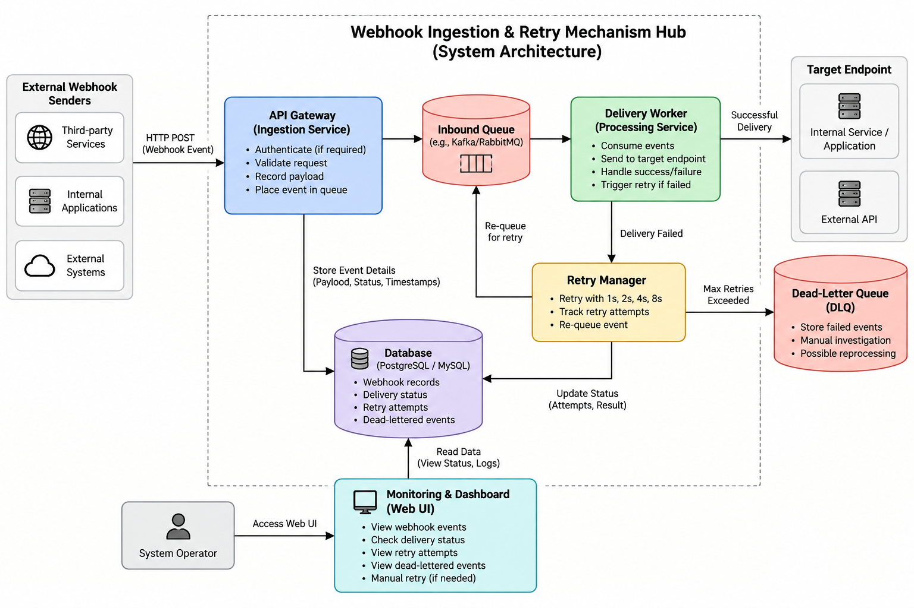

# Architecture Component Modelling

This section describes the major components of the Webhook Ingestion & Retry Mechanism Hub and how they interact with each other.

## Main Components

- **API Gateway (Ingestion Service)** – Receives webhook events, validates requests, records payloads, and places events into the queue.
- **Inbound Queue** – Temporarily stores incoming webhook events for processing.
- **Delivery Worker (Processing Service)** – Consumes events from the queue and sends them to the target endpoint.
- **Retry Manager** – Handles failed deliveries and retries them using increasing retry intervals.
- **Dead-Letter Queue (DLQ)** – Stores events that continue to fail after the maximum number of retries.
- **Database** – Stores webhook records, delivery status, retry attempts, and failed events.
- **Monitoring & Dashboard** – Allows the system operator to view webhook events, delivery status, retry attempts, and dead-lettered events.
- **Target Endpoint** – Represents the internal service/application or external API receiving the webhook.

## Component Interaction

The API Gateway receives webhook events from external or internal sources and places them into the Inbound Queue. The Delivery Worker processes the queued events and sends them to the target endpoint.

If delivery fails, the Retry Manager handles the retry process. Events that exceed the maximum retry limit are moved to the Dead-Letter Queue. The Database stores the event details and delivery status throughout the process.

The Monitoring & Dashboard provides the system operator with information about events, delivery status, retries, and failed events.

## Architecture Diagram

